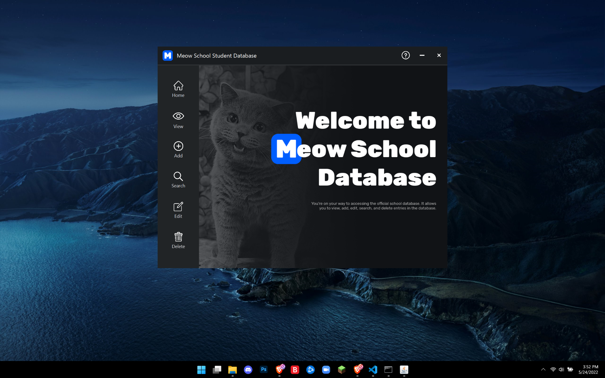
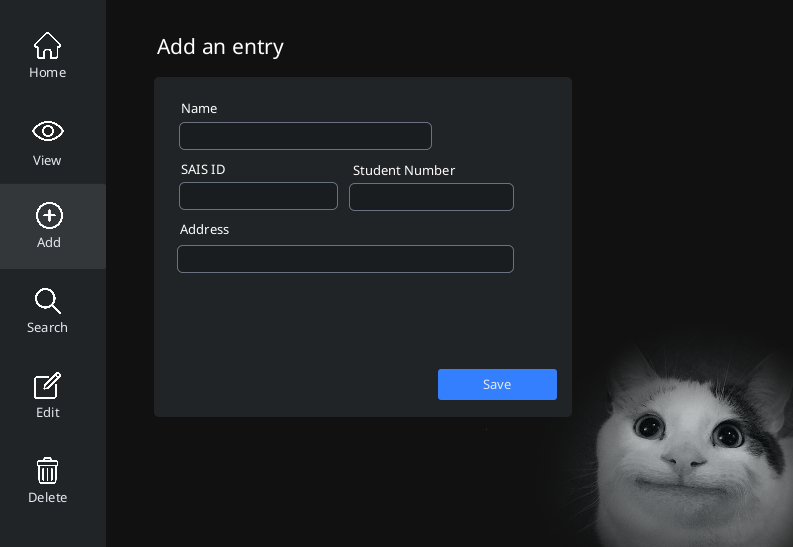
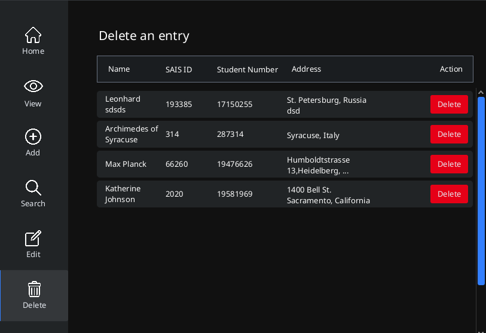

# Student Database Program


## Introduction

Meow Student Database is a student database which has functions to
add, delete, search, and edit data entries. This database stores
student information that includes their names, SAIS ID (a number
identifier for the school portal), Student Number (an identification
for their university information), and their address

This application uses a custom implementation of the `linked list` data structure in 
in storing the entries in the database. In addition to that, it leverages the 
[JavaFX](https://openjfx.io/), UI library for the frontend of the application.

## Features
- Modern slick "feline' design
- Changes are automatically saved to a file called `database.dat`
- Runs on Linux, Mac and Windows!

## Project Directory

```
├── student-database-program
│   ├── build
│   ├── gradle
│   ├── src
│   │   ├── main
│   │   │   ├── MP
│   │   │   │   ├── components
│   │   │   │   ├── interfaces
│   │   │   │   └── linkedList
│   │   │   └── resources
│   │   │       ├── fxml
│   │   │       │   └── css
│   │   │       └── icons
│   │   └── test
│   │       └── MP
│   ├── build.gradle
│   ├── gradlew
│   ├── gradlew.bat
│   └── settings.gradle
```

## Running the Application

Make sure that you are on the root of the project directory, and run 
the following command:
```
gradlew run
```

On unix style operating systems do:
```
./gradlew run
```

Or alternatively if you have gradle installed on your system, you can also do:
```
gradle run
```

## Screenshots


